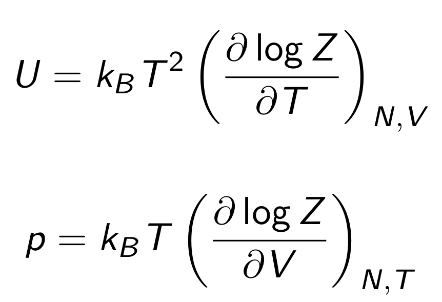
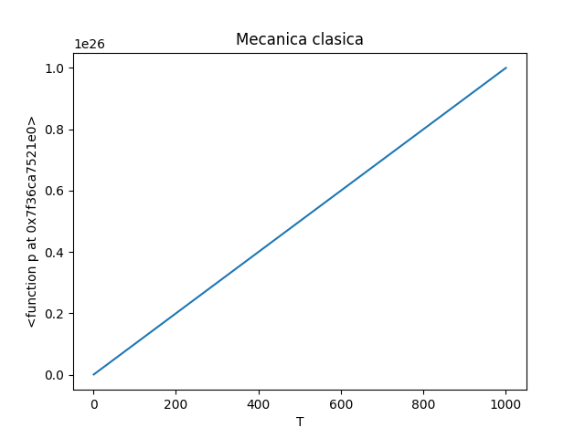
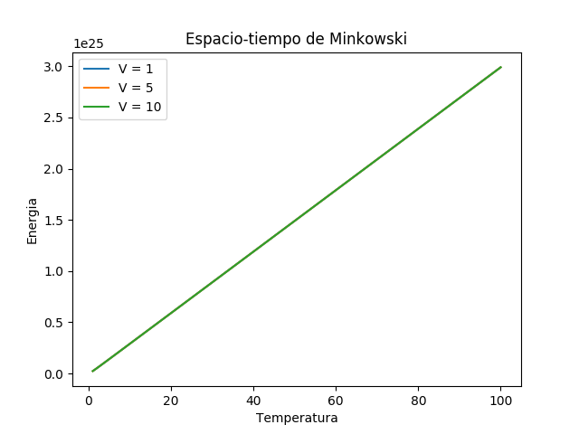
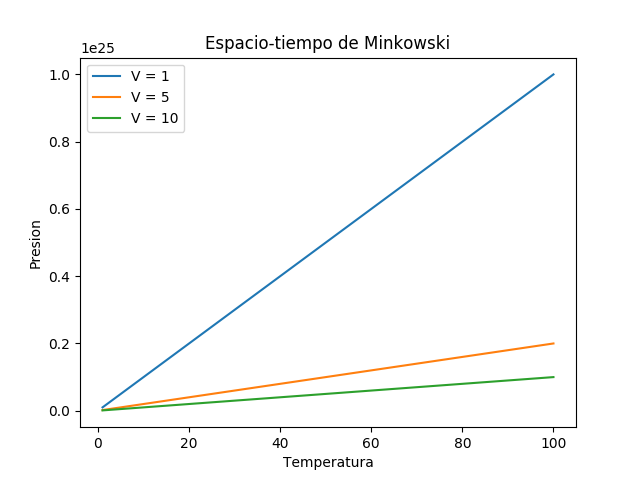
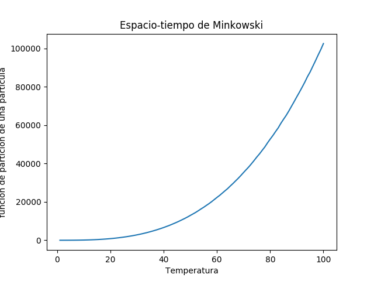
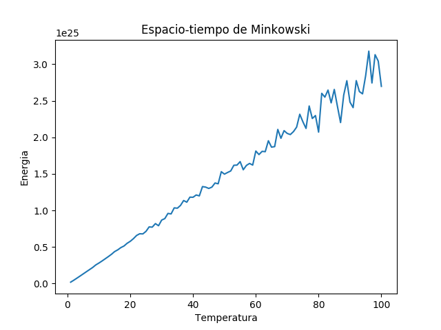
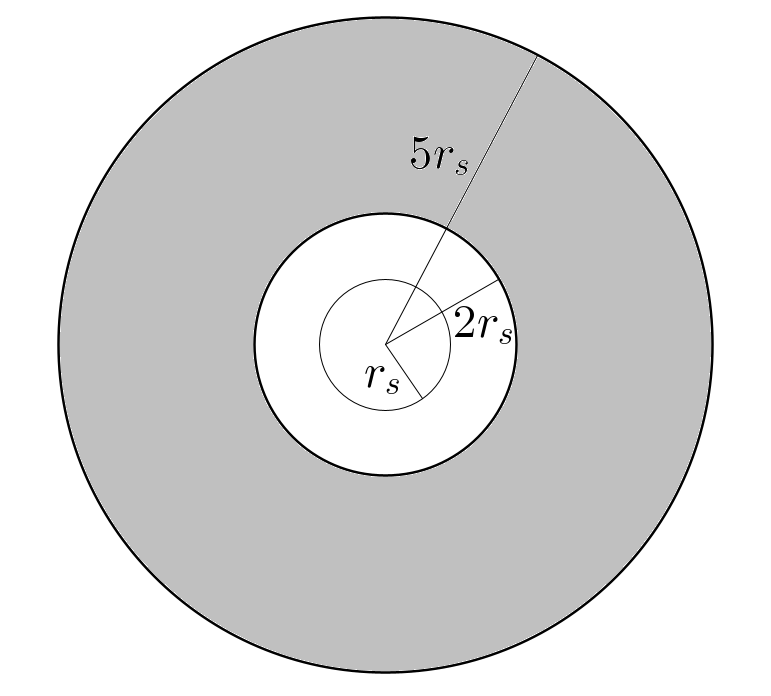
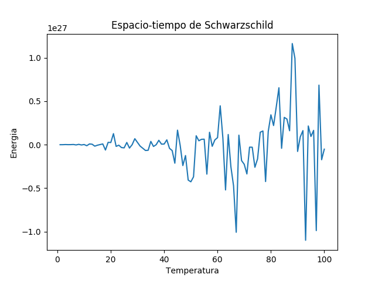

# Gases ideales en espacios tiempos curvos

¿Cómo se comporta un gas ideal en el [espacio-tiempo]?, ¿y en un espacio-tiempo curvo? Este proyecto tiene por objetivo tratar estas interrogantes, en concreto, tratar de determinar las relaciones presión _P_ contra temperatura _T_ y energía _E_ vs temperatura _T_, para un gas ideal en el exterior de un objeto astrofı́sico con simetrı́a esférica, esto es, en el [espacio-tiempo de Schwarzschild].

Dado que el enfoque es numérico, a fin de facilitar los cálculos se eligieron [unidades naturales]. Para hallar las relaciones _P_ vs _T_ y _E_ vs _T_ se procedió a encontrar la [función de partición] del sistema (usando el [ensamble canónico]). Una vez teniendo esto, la energía (aquí llamada _U_) y la presión se obtienen a través de las relaciones:

Primeramente se realizó esto para el espacio plano Euclideano, a fin de recuperar resultados ya conocidos. La funciòn de partición se encuentra facilmente de manera analítica. Para hallar las relaciones _P_ vs _T_ y _E_ vs _T_ se hizo derivación numérica en [Python] usando la biblioteca [scipy]. A continuación se muestra cómo se recupera la relación presión vs temperatura para un [gas ideal], fijando un volumen igual a la unidad

El código para generar esta imagen está en la ruta _src/Euclideano/ideal.py_ y la imagen se obtuvo con la biblioteca [matplotlib].

Posteriormente, se procedió con el espacio-tiempo de Minkowski. Primero se encontró la función de partición haciendo integración numérica en 3 dimensiones, también con scipy, y se encontrarón las siguientes gráficas para diversos volúmenes:

El código para generar estas imágenes está en la ruta _src/Minkowski/minkowski.py_ y también se obtuvieron con matplotlib.

Antes de pasar al problema de la métrica de Schwarzchild, este mismo problema de la métrica de Minkowski se resolvió utilizando [integración estocástica], pues pronto la integración numérica ordinaria toma mucho tiempo por ser en varias dimensiones. Ésto se hizo usando el lenguaje [C++]. A continuación se muestra la función de partición de una partícula en el espacio-tiempo de Minkowski y la energía como función de la temperatura, obtenidas con integración estocástica. Las imágenes se obtuvieron con la biblioteca [matplotlib para C++].

El resultado obtenido naturalmente coincide con el anterior, aunque en la gráfica de la energía ya se puede apreciar el ruido causado por la integración estocástica. El código fuente para generar estas imágenes está en la ruta _src/Minkowski/minkowski.cpp_

Por último, se atacó el problema original en la métrica de Schwarzschild para la siguiente volumen:

Sin embargo, por el enfoque usado no se obtuvo ningún resultado satisfactorio, como se puede apreciar en la siguiente imagen:

El problema principal, además del ruido causado por la integración estocástica, fue la derivación numérica. Claramente no es el mejor enfoque (pues además de no obtener nada concluyente, la ejecución del código tomó varias horas) y existen mejores técnicas para tratar de dar respuesta a estas interrogantes. Siéntase libre el lector de hacer esto último.

Para más detalles sobre los aspectos teóricos se puede consultar la [presentacion del proyecto].

Éste trabajo se realizó como proyecto final del curso de [Física Estadística] de la licenciatura en [Física] de la [Facultad de Ciencias] en el semestre 2020-2, a cargo del [Dr. Rafael Barrios].

[espacio-tiempo]: <https://es.wikipedia.org/wiki/Espacio-tiempo>

[espacio-tiempo de Schwarzschild]: <https://es.wikipedia.org/wiki/Métrica_de_Schwarzschild>

[unidades naturales]: <https://es.wikipedia.org/wiki/Unidades_de_Planck#:~:text=Las%20unidades%20de%20Planck%20o,masa%2C%20carga%20eléctrica%20y%20temperatura.&text=El%20uso%20de%20este%20sistema%20de%20unidades%20trae%20consigo%20varias%20ventajas.>

[función de partición]: <https://es.wikipedia.org/wiki/Función_de_partición_(física)>

[ensamble canónico]: <https://es.wikipedia.org/wiki/Colectividad_canónica>

